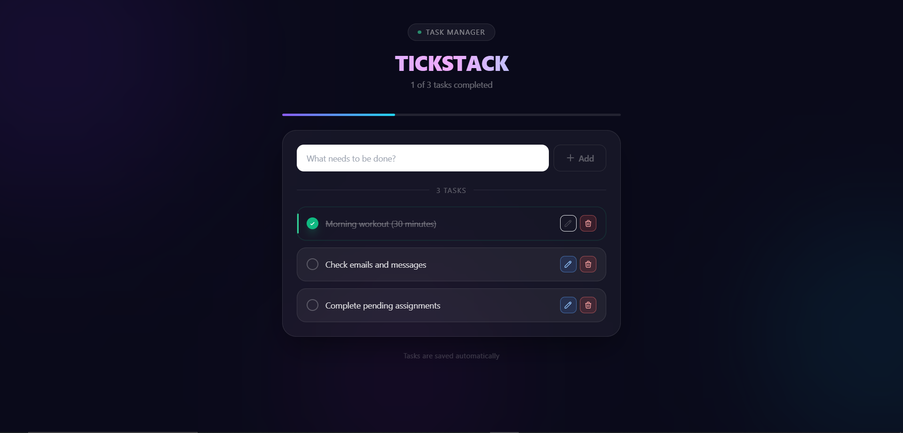

<div align="center">

# TickStack

**A sleek, minimal, and blazing-fast task manager built with React.**  
Manage your day with style — no clutter, no complexity, just your tasks.

[](https://reactjs.org/)
[](https://vitejs.dev/)
[](https://tailwindcss.com/)
[](LICENSE)

</div>

---

## 📸 Demo

<div align="center">

### Main Interface



</div>
<!-- 
> **📁 Screenshots location:** `public/screenshots/`  
> Replace the filenames above with your actual screenshot filenames. -->

---

## ✨ Features

- ✅ **Add Tasks** — Quickly add tasks with a clean input and a single click
- ✏️ **Inline Edit** — Edit any task in-place with a single click; press `Enter` to save or `Escape` to cancel
- 🗑️ **Delete Tasks** — Remove tasks instantly with a confirmation-free delete
- ☑️ **Toggle Complete** — Mark tasks done with a satisfying custom checkbox
- 📊 **Progress Bar** — Visual indicator of how many tasks you've crushed today
- 💾 **Persistent Storage** — All tasks auto-save to `localStorage` — your data survives refreshes
- 🎨 **Modern UI** — Glassmorphism design with animated ambient gradients and smooth micro-interactions
- 📱 **Responsive** — Works seamlessly on mobile, tablet, and desktop

---

## 🛠️ Tech Stack

| Technology          | Purpose                                                       |
| ------------------- | ------------------------------------------------------------- |
| **React 18**        | UI library with hooks (`useState`, `useEffect`, `useContext`) |
| **Vite**            | Lightning-fast dev server & build tool                        |
| **Tailwind CSS v3** | Utility-first styling with custom animations                  |
| **Context API**     | Global state management via `TodoContext`                     |
| **localStorage**    | Client-side persistence (no backend needed)                   |

---

## 🏗️ Project Structure

```
tickstack/
├── public/
│   └── screenshots/          # Project screenshots for README
├── src/
│   ├── components/
│   │   ├── TodoForm.jsx       # Input form to add new tasks
│   │   └── TodoList.jsx       # Individual task card (edit/delete/toggle)
│   ├── contexts/
│   │   └── TodoContext.js     # Context creation, Provider export, useTodo hook
│   ├── App.jsx                # Root component — state, effects, layout
│   └── main.jsx               # React DOM entry point
├── index.html
├── tailwind.config.js
├── vite.config.js
└── package.json
```

---

## ⚙️ Architecture & Design Decisions

### State Management — React Context API

Rather than prop-drilling through multiple layers, TickStack uses the **Context API** to distribute the todo state and all action handlers (`addTodo`, `updateTodo`, `deleteTodo`, `toggleComplete`) globally. Any component can consume the context via the custom `useTodo()` hook — clean, minimal, and no third-party library required.

```js
// Consuming context anywhere in the tree
const { todos, addTodo, deleteTodo } = useTodo();
```

### Persistence — localStorage

Two `useEffect` hooks handle persistence elegantly:

1. **On mount** — reads saved todos from `localStorage` and hydrates state
2. **On todos change** — syncs the latest state back to `localStorage` after every update

```js
// Hydrate on mount
useEffect(() => {
  const saved = JSON.parse(localStorage.getItem("todosList"));
  if (saved?.length > 0) setTodos(saved);
}, []);

// Persist on every change
useEffect(() => {
  localStorage.setItem("todosList", JSON.stringify(todos));
}, [todos]);
```

### Component Responsibilities

| Component        | Responsibility                                                                                   |
| ---------------- | ------------------------------------------------------------------------------------------------ |
| `App.jsx`        | Owns all state, defines all handlers, renders layout                                             |
| `TodoForm.jsx`   | Controlled input, calls `addTodo` on submit                                                      |
| `TodoList.jsx`   | Renders one todo, handles local edit state, calls `updateTodo` / `deleteTodo` / `toggleComplete` |
| `TodoContext.js` | Creates context with default shape, exports `TodoProvider` and `useTodo`                         |

---

## 🚀 Getting Started

### Prerequisites

- [Node.js](https://nodejs.org/) v18 or higher
- npm / yarn / pnpm

### Installation

```bash
# 1. Clone the repository
git clone https://github.com/your-username/tickstack.git

# 2. Navigate into the project
cd tickstack

# 3. Install dependencies
npm install

# 4. Start the development server
npm run dev
```

The app will be running at **http://localhost:5173**

### Build for Production

```bash
npm run build
```

Compiled output will be in the `dist/` folder, ready to deploy.

### Preview Production Build

```bash
npm run preview
```

---

## 📦 Available Scripts

| Script            | Description                        |
| ----------------- | ---------------------------------- |
| `npm run dev`     | Start Vite dev server with HMR     |
| `npm run build`   | Build optimized production bundle  |
| `npm run preview` | Serve the production build locally |
| `npm run lint`    | Run ESLint across the project      |

---

## 🎨 UI Highlights

TickStack features a dark glassmorphism design built entirely with Tailwind CSS utilities:

- **Ambient background** — Three layered, blurred gradient orbs (`violet`, `cyan`, `fuchsia`) that pulse gently
- **Glass card** — `backdrop-blur-xl` + `bg-white/5` + `border-white/10` container
- **Gradient heading** — `bg-clip-text` with a three-stop gradient
- **Live progress bar** — Animates smoothly as you complete tasks
- **Staggered entry animations** — Each task fades and slides up with a `50ms` delay offset
- **Color-coded buttons** — Blue for edit, green for save, red for delete — always visible, no hover-to-reveal

---

## 🔮 Future Improvements

- [ ] Drag-and-drop reordering of tasks
- [ ] Due dates and priority levels
- [ ] Filter/search tasks (All / Active / Completed)
- [ ] Categories or project tags
- [ ] Dark / Light theme toggle
- [ ] Sync with a backend (Appwrite / Supabase / Firebase)
- [ ] PWA support for offline use

---

## 🤝 Contributing

Contributions are welcome! If you have an idea or found a bug:

1. Fork the repo
2. Create a feature branch: `git checkout -b feature/your-feature`
3. Commit your changes: `git commit -m 'feat: add your feature'`
4. Push the branch: `git push origin feature/your-feature`
5. Open a Pull Request

---

## 📄 License

This project is licensed under the **MIT License** — see the [LICENSE](LICENSE) file for details.

---

<div align="center">

Made with ❤️ and React

⭐ **Star this repo if you found it useful!**

</div>
